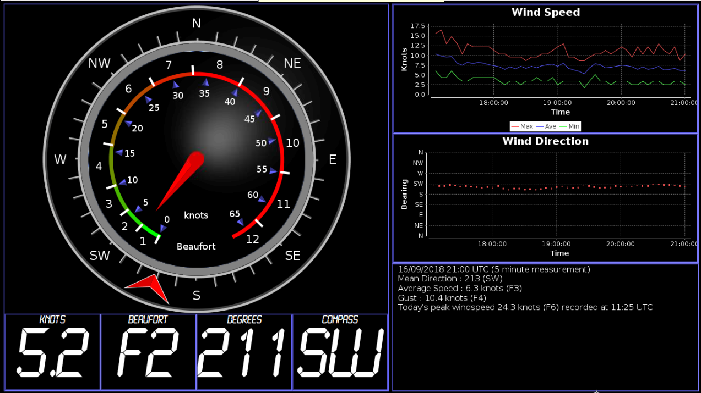

windmon
=======
A Java application to display NMEA wind data.

Created by me for the Marconi Sailing Club back in 2004/5 to display windo data obrained from an Autonnic NMEA masthead unit.

Dropped the code GitHub a few years later. Only done a bit of tweaking and tidying since then. Its starting to look a bit dated now but still in use.

The software was originally run on x86 PC running Ubuntu, but now runs on Raspberry Pi running Raspbian.

The Autonnic masthead reached end of life and was replaced by a NASA Marine unit. This didn't prove to be as reliable or accurate. The sailing club now has a Davis Vantage Pro weather station connected to a Raspbery Pi running Weewx. I have created a Weewx plugin which converts wind data into NMEA sentences and exposes this data feed over a TCP/IP socket server.
